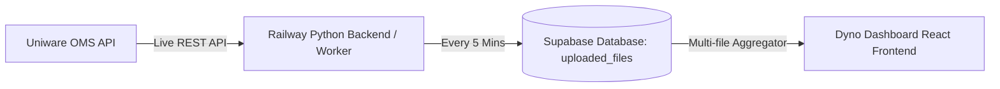

# 📊 Dyno Sales Dashboard

A high-performance, real-time e-commerce sales analytics and inventory intelligence platform connected directly to **Uniware OMS API** and **Supabase Database**.


---

## ⚡ Real-Time Uniware API Integration

Dyno Dashboard is powered by a live ingestion pipeline communicating directly with Uniware REST APIs:

### 1. 🔄 Live Order Ingestion Engine
- **Automated Sync**: Ingests new sale orders every 5 minutes in the background without UI interruption.
- **Dynamic 12:01 AM IST Rolling Window**: Ingestion starts automatically at **12:01 AM IST** each day and continues up to the current minute.
- **Daily Rollover**: At the turn of the day (12:01 AM IST), the window automatically advances to the new date (e.g., `13 August`), preserving past days in Supabase.
- **High-Concurrency Fetching**: Pulls full line-item details using parallel worker batches.

### 2. 🏷️ Master Item Directory & Live Auto-Enrichment
- **52,900+ Master SKU Directory**: Instant in-memory enrichment for Style Code, Color, Category, Division, Size, and Brand.
- **Prefix Deduction Engine**: Automatic deduction for Footwear (`CASUAL SHOES`, `SLIDES`, `MOULDS`), Apparel (`JEANS`, `SHIRT`, `DRESS`, `TSHIRT`, `SHORTS`, `TROUSER`), and Accessories (`CAP`, `SOCKS`, `BAG`) with strict isolation from color codes.
- **Uniware Item Master Auto-Learning**: Automatically fetches and registers newly launched SKUs from Uniware’s Catalog Master API on the fly.

### 3. 💰 Dynamic Pricing Calculation (Ajio, Cocoblu, Flipkart)
- For channels where raw Selling Price requires dynamic discount calculation:
  $$\text{MyntraAvgDiscount} = \frac{\sum \left(1 - \frac{\text{SP}_i}{\text{MRP}_i}\right)}{N_{\text{Myntra}}}$$
  $$\text{SP}_{\text{Ajio / Cocoblu / Flipkart}} = \text{MRP} - \left(\text{MRP} \times \text{MyntraAvgDiscount}\right)$$

### 4. 🌐 Staging Layer & Zero-Disruption UI
- **Silent Background Staging**: Fresh orders are saved directly to the database staging layer every 5 minutes.
- **Smart Refresh Button**: Shows **`New Data Ready (Refresh)`** when staged updates are available, letting you refresh the UI only when you want.
- **1-Click "Today" Quick Filter**: Toggle on/off to instantly jump to today's live orders.

---

## 🚀 Live Demo & Production Architecture

- **Frontend**: [https://dyno-dashboard.vercel.app](https://dyno-dashboard.vercel.app)
- **Railway Backend**: [https://railway.com/project/8a2ac671-7ec1-43be-a94a-312ab539f308](https://railway.com/project/8a2ac671-7ec1-43be-a94a-312ab539f308)

### Architecture Overview


---

## ✨ Features

### 📈 Sales Overview & Real-Time Analytics
- Real-time tracking of **Revenue**, **Units**, **ASP** (Average Selling Price), and **Active Channels**.
- Interactive charts powered by Recharts (Bar, Line, and Pie charts).
- Dynamic cascading filters for **Fiscal Year**, **Month**, **Date**, **Division**, **Channel**, **Category**, and **Gender**.
- Quick **"Today"** button for immediate 1-click inspection of today's live orders.

### 🎯 Target & Goal Tracking
- Monthly and Yearly target tracking based on business goals.
- Visual progress meters for "Target vs Achievement".
- Units Left calculation and performance breakdown for **Apparel** and **Footwear**.

### 🌟 Smart Insights & Top Performers
- **Top 5 Bestsellers**: Fast identification of best-selling styles, categories, and top revenue drivers.
- **Toggle Views**: Switch between Revenue Insights and Unit Insights in 1 click.

### 📦 Merchandising Corner & Inventory Intelligence
- Low-stock cover alerts, Days of Cover (DOC) calculation, and 60-day replenishment recommendations.
- SKU Live Dates tracking and custom launch date analysis.

### 📂 Raw Files & Data Management (Admin)
- **Upload Master Item Directory**: Push latest catalog spreadsheets (`.xlsx`/`.csv`) to update SKUs dynamically.
- **Upload Sales, Returns & Inventory**: Historical data bulk ingestion and reconciliation.

---

## 🛠️ Tech Stack

- **Frontend**: React.js 18, Vite, Recharts, Lucide React, Vanilla CSS Design System
- **Real-Time Integration**: Uniware OMS REST API, OAuth 2.0 Client
- **Backend & Background Workers**: Python Flask, Node.js (`sync_worker.js`)
- **Database**: Supabase (PostgreSQL)
- **Cloud Deployment**: Railway (Backend & 24/7 Worker), Vercel (Frontend)

---

## ⚙️ Running Locally

1. **Clone the repository**:
   ```bash
   git clone https://github.com/MNegi17/Dyno-Dashboard.git
   cd Dyno-Dashboard
   ```

2. **Install dependencies**:
   ```bash
   npm install
   pip install -r requirements.txt
   ```

3. **Run 24/7 Background Sync Worker**:
   ```bash
   # Single execution:
   node sync_worker.js --once

   # Continuous 5-minute loop:
   node sync_worker.js
   ```

4. **Start Local Development Server**:
   ```bash
   npm run dev
   ```

---

## 📄 License
Maintained by MNegi 17.
