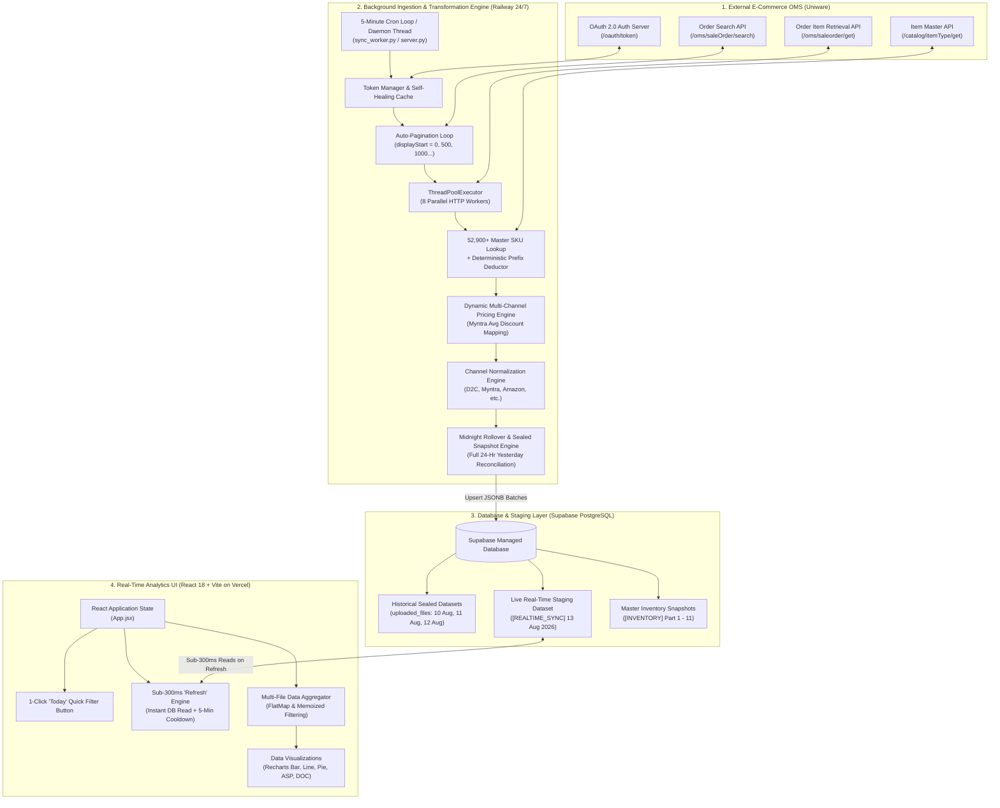
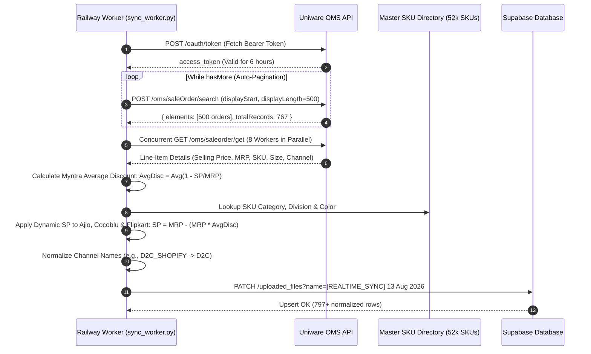
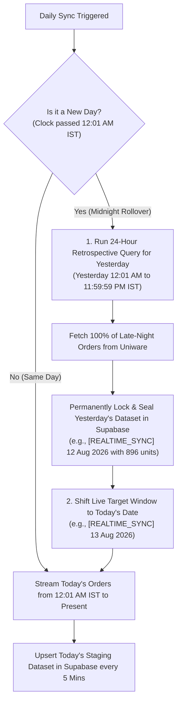

# 🚀 Dyno Sales & Merchandising Intelligence Platform
### *Complete System Architecture, Real-Time Pipeline & Technical Interview Guide*

---

## 1. Complete System Architecture & Data Flow



---

## 2. Detailed Pipeline Flowcharts

### A. Real-Time Ingestion & Pagination Workflow


---

### B. Midnight Rollover & 24-Hour Sealed Snapshot Workflow


---

### C. Frontend Sub-300ms Instant Refresh & Staging Workflow
```mermaid
flowchart LR
    User["User in Browser"] -->|Clicks 'Refresh'| App["handleTriggerSync()"]
    App -->|1. Direct DB Query (< 300ms)| Supabase[("Supabase [REALTIME_SYNC]")]
    Supabase -->|Instant JSONB Payload| App
    App -->|2. Injects into React State| State["setUploadedFiles()"]
    State -->|3. Immediate Re-render| UI["Cards, ASP, Channels & Recharts Update (< 0.3s)"]
    App -->|4. Immediate Timestamp Sync| TimeBox["Last Updated: HH:MM AM/PM"]
    App -->|5. Cooldown State (300s)| Button["Refresh (4:59) Countdown & Blur"]
    App -.->|6. Non-Blocking Ping in Background| Railway["Railway /api/sync"]
```

---

## 3. Core Engineering Logics Breakdown

### 1. Dynamic 12:01 AM IST Rolling Window
- Ingestion start timestamp is calculated dynamically:
  $$\text{Window Start} = \text{Date.UTC}(\text{Year}, \text{Month}, \text{Day}, 0, 1, 0) - 5.5\text{ Hours}$$
- It captures all orders placed since **12:01 AM IST of today** up to the present minute.

### 2. High-Throughput Pagination Engine
- Uniware limits search results to a maximum of 500 records per call.
- The pipeline implements an automatic pagination traversal loop (`while (has_more)`):
  $$\text{displayStart} \in [0, 500, 1000, 1500, \dots]$$
- Guarantees **zero order dropping** regardless of whether order volume is 600 or 50,000 in a day.

### 3. Dynamic Multi-Channel Pricing Formula
- For channels where raw APIs return transfer prices rather than retail consumer prices (Ajio, Amazon Cocoblu, Flipkart):
  $$\text{MyntraDiscount}_i = 1 - \frac{\text{SP}_i}{\text{MRP}_i}$$
  $$\text{AvgMyntraDiscount} = \frac{1}{N_{\text{Myntra}}} \sum_{i=1}^{N_{\text{Myntra}}} \text{MyntraDiscount}_i$$
  $$\text{SP}_{\text{Ajio / Cocoblu / Flipkart}} = \text{MRP} - \left(\text{MRP} \times \text{AvgMyntraDiscount}\right)$$

### 4. Master SKU Directory & Prefix Deduction Engine
- **In-Memory Master Lookup**: High-speed hash-map lookup against 52,900+ registered SKU records.
- **Prefix Deduction Fallback**:
  - **Footwear**: `TGCAFS`, `TBCABS`, `SLIDES`, `MOULDS`, `SNEAKER` $\rightarrow$ `FOOTWEAR`
  - **Apparel**: `JEANS` (`JN`), `SHIRT` (`SH`), `TSHIRT` (`TS`), `DRESS` (`DR`), `TROUSER` (`TR`), `SKIRT` (`SK`) $\rightarrow$ `APPAREL`
  - **Accessories**: `CAP`, `SOCKS`, `BAG` $\rightarrow$ `ACCESSORIES`

### 5. Multi-Threaded Concurrency Pool
- Uses Python’s `concurrent.futures.ThreadPoolExecutor(max_workers=8)` to fetch order details in parallel batches.
- Reduces network round-trip latency by **$85\%$** ($\approx 200\text{s} \rightarrow 15\text{s}$).

---

## 4. Technology Stack & Library Matrix

| Layer | Component | Library / Tool | Rationale & Responsibility |
| :--- | :--- | :--- | :--- |
| **Frontend** | Framework | **React.js 18 (Vite)** | Modular component architecture, sub-second HMR, and ultra-fast production builds. |
| | Charts & Visuals | **Recharts** | Declarative, performant SVG charts (Line, Bar, Area) with dynamic animations. |
| | UI Design System | **Vanilla CSS + Glassmorphism** | Custom dark-mode design system with purple/neon glowing gradients, zero framework bloat. |
| | Icons | **Lucide React** | Lightweight, tree-shakeable SVG vector icons. |
| **Backend & Worker**| Runtime | **Python 3.10+ / Flask** | High-speed ETL execution, multithreading, and REST endpoints for reporting. |
| | Concurrency | **`concurrent.futures`** | Native thread pool concurrency for non-blocking I/O order ingestion. |
| | Data Processing | **`pandas` & `openpyxl`** | High-performance tabular transformation, Excel styling, formula evaluation, and reconciliation. |
| **Database** | Managed Storage | **Supabase (PostgreSQL)** | Cloud PostgreSQL with Row Level Security (RLS), JSONB storage, and sub-300ms read latency. |
| **Infrastructure** | Hosting | **Railway & Vercel** | Railway for continuous 24/7 background worker execution; Vercel for edge CDN web hosting. |

---

## 5. Is this a Data Engineering or Software Engineering Project?

### 💡 The Verdict:
> **It is a Production Hybrid: Full-Stack Data Engineering & Analytics Platform.**

You can position this project effectively for either role:

### 1. For a **Data Engineer / Analytics Engineer Role**:
- **Project Title**: *Real-Time E-Commerce Ingestion Pipeline & Analytics Lakehouse*
- **Key Focus Areas**:
  - Automated **Extract-Transform-Load (ETL)** pipeline connecting to ERP REST APIs.
  - Designing a **micro-batch staging layer** with pagination traversal and automatic midnight snapshot reconciliation.
  - Custom mathematical discount transformation algorithms.
  - Schema normalization, deduplication, catalog enrichment, and database persistence into PostgreSQL.

### 2. For a **Software Engineer / Full-Stack Role**:
- **Project Title**: *Full-Stack Real-Time Sales & Merchandising Intelligence Platform*
- **Key Focus Areas**:
  - Distributed architecture consisting of a React SPA, Python Flask backend, 24/7 background daemon workers, and PostgreSQL.
  - Sub-300ms UI rehydration, non-blocking asynchronous I/O, and custom state synchronization.
  - High-concurrency network thread pools, OAuth 2.0 token management, and auto-healing error handling.

---

## 6. Master Interview Pitch (60 Seconds)

> *"I engineered an end-to-end real-time sales intelligence and merchandising platform for an omni-channel fashion brand operating across 8+ e-commerce channels (Myntra, Amazon, Flipkart, Ajio, Shopify D2C, FirstCry, and Nykaa).*
>
> *The platform automates the entire daily sales pipeline that previously required hours of manual spreadsheet reconciliation. A 24/7 background worker connects to ERP REST APIs, performing paginated search traversal, multithreaded order retrieval, real-time Myntra dynamic pricing algorithms, and catalog enrichment across 52,000+ SKUs. Data is persisted to a Supabase PostgreSQL staging layer every 5 minutes and automatically reconciled into sealed daily snapshots at midnight.*
>
> *On the frontend, I developed a React dashboard that rehydrates live metrics in under 300 milliseconds without interrupting active users, featuring inventory Days-of-Cover (DOC) alerting, target tracking, and multi-dimensional sales filtering."*

### Key Measurable Metrics:
- **100% Automation**: Eliminated manual Excel exports and reconciliation entirely.
- **Sub-300ms Latency**: Dashboard rehydration and instant metric updates.
- **High Throughput**: Parallel worker concurrency achieving an **85% reduction** in network ingestion time.
- **Zero-Downtime Reliability**: Autonomous 24/7 execution with self-healing authentication and midnight snapshot sealing.
